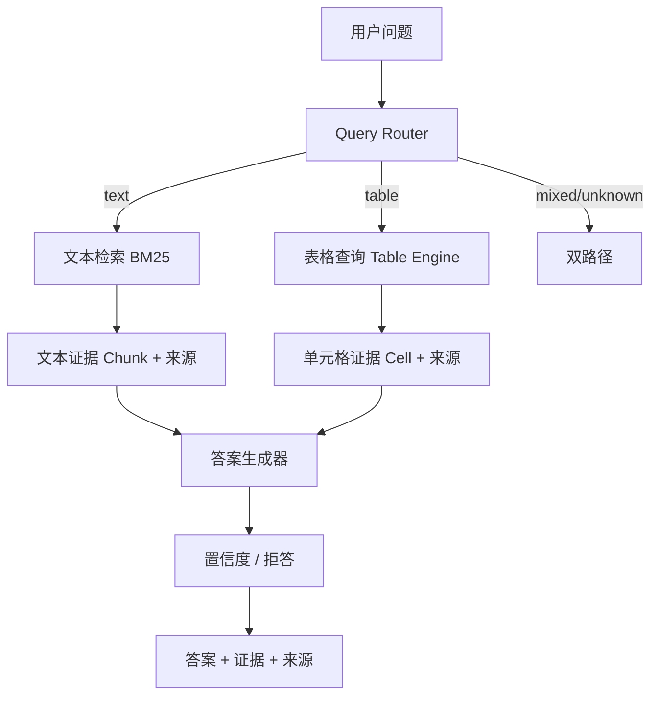

# 设计文档：面向监管制度与统计报表的可信 RAG 问答系统

## 1. 项目背景

银行业经营管理高度依赖监管制度、业务规程、统计报表和内部操作文件。资料分散于 Word、PDF、Excel 等多种异构格式，人工查询容易出现文件查找慢、条款定位不准、旧版新规混淆、指标口径理解错误等问题。

本系统面向两类数据（监管制度文本、统计报表）构建可信 RAG 问答能力：从多源异构资料中检索依据，回答制度事实、条款阈值、统计取数、跨文件比较等问题，并返回可追溯证据（文件名、页码/段落/章节/条款、Sheet/单元格坐标）。

核心原则：**Evidence First（证据优先）**、**No Evidence, No Answer（无证据不答）**、**Text 与 Table 分路径处理**。

## 2. 需求分析

- 文档解析：Word/PDF 文本 + Excel 结构化表格，保留来源元数据。
- 文本检索：至少 BM25，返回 Top-K 相关文本块及来源。
- 表格取数：至少一种结构化取数，不得"整个 Excel 转文本后交给 LLM 猜测"。
- 答案与证据：输出答案 + 证据 + 源文件 + 位置；无可靠依据时拒答。
- 自动评测：批量跑测试集、统计正确率、保存错题并做错误分析。
- 无 API 模式：不强制依赖商业 API，默认使用规则/抽取式回答。

## 3. 系统总体架构



模块划分：

```
src/
├── parsers/       Word/PDF/Excel 解析与统一 Schema
├── knowledge/     文本切分（Chunk）与元数据
├── retrieval/     BM25 / 向量 / 混合检索 / 重排
├── table_query/   表格索引与结构化取数引擎
├── qa/            路由、答案生成、置信度、流水线
├── evaluation/    评测器、指标、错误分析
└── utils/         配置、日志
```

## 4. 数据解析设计

- **统一 Schema**（`src/parsers/schemas.py`）：
  - `TextChunk`：`chunk_id/text/source_file/page/paragraph/section/article/metadata`，`source_file` 与 `text` 必填。
  - `TableRecord`：`source_file/sheet/row/column/cell/value/row_labels/column_labels/unit/...`，保留单元格位置。
- **Word**：`python-docx` 按文档顺序迭代段落与表格；结构识别见下。
- **PDF**：`PyMuPDF` 逐页、逐行提取，保留页码，检测空页/扫描件。
- **Excel**：`openpyxl(data_only=True)`；合并单元格 forward-fill；自动识别表头行与标签列；为每个数值单元格关联行标签/列表头/单位。

## 5. Chunk 策略

优先级：**条款 > 段落 > 标题结构 > 长度切分**。

1. 按标题元素（章/节/条）把文档切成块，保证"第X条 + 其内容"在同一块；
2. 块超过 800 字符时按段落二次切分，允许 50 字符重叠；
3. 每块继承 `source_file/page/paragraph/section/article`。

结构识别（`src/parsers/structure.py`）：正则匹配 `第一章`、`第X节`、`第X条`、`（一）`、`1.` 等，并维护"当前章节"上下文。

## 6. BM25 Retrieval

- 依赖 `rank-bm25` + `jieba` 中文分词；
- 额外把"条款号"（第X条）与"数字/百分号"作为独立 token，提升精确关键词检索；
- 规则增强：问题含"第X条"或数字时，对命中对应条款号/数字的 Chunk 加分（见 `_rule_boost`）。

统一接口：`retrieve(query, top_k) -> [{text, score, source}]`。

## 7. Vector / Hybrid Retrieval

- 向量检索（`vector_retriever.py`）为**可选增强**：依赖 `sentence-transformers`（推荐 `BAAI/bge-small-zh-v1.5`），未安装时 `is_available()` 返回 False。
- 混合检索（`hybrid_retriever.py`）：BM25 + 向量，用 **Reciprocal Rank Fusion (RRF)** 融合；向量不可用时自动退化为纯 BM25。
- **当前环境未安装 sentence-transformers，系统以 BM25 为唯一检索路径**，因此不构成单点故障。重排（`reranker.py`）提供轻量规则重排作为可选增强。

## 8. Excel Table Query

目标流程：问题 → 识别查询意图（指标/期间/机构）→ 候选文件/Sheet → 匹配行/列 → 定位 Cell → 返回数值 + 证据。

- **意图解析**（`table_matcher.py`）：正则抽取期间（年/季度/月/年末）、机构（A机构/某银行）；指标名用 `rapidfuzz` 模糊匹配（partial_ratio / token_sort_ratio / WRatio）。
- **归一化**：去空格、全半角、括号、百分号、统一"年底/年末"。
- **机构名 vs 指标名区分**：识别"机构类"标签并在指标匹配时跳过，避免机构名污染指标匹配；抽取的机构用"是否出现在数据标签中"做验证（如"商业银行"是类别而非机构，会被丢弃）。
- **取数与比较**：单点取数返回数值+单位；`X比Y高/低多少` 比较题定位两个单元格求差值。
- **拒答**：指定期间但完全无命中时返回"未找到足够证据"。

## 9. Evidence 与可信回答设计

- 每个答案附带 `evidence`（文本证据 / 表格证据）与 `sources`（来源摘要）。
- 文本来源：文件名、页码、段落、章节、条款。
- 表格来源：文件名、Sheet、行列、Excel 坐标（如 D12）。

## 10. 拒答机制

- **文本**：计算问题内容词在 Top-1 证据中的覆盖率，低于阈值（0.6）判定 `no_evidence`，回答"未找到足够证据"。
- **表格**：指标/期间/机构匹配分数不足，或指定期间无命中，判定 `no_evidence`。
- LLM 使用时通过 System Prompt 约束"只能根据 Evidence 回答，不得编造"。

## 11. Evaluation

- 测试集加载器支持 JSON/CSV/Excel，字段名集中映射（question/answer/type）。
- 逐题运行流水线，判定正确性，统计 `total/correct/incorrect/accuracy` 及分题型正确率。
- 输出 `outputs/evaluation.json` 与 `outputs/evaluation.csv`。

## 12. 测试结果

| 指标 | 值 |
|------|-----|
| 总体正确率 | 100%（20/20） |
| 文本题正确率 | 100% |
| 表格题正确率 | 100% |

单元测试：30 项全部通过（`pytest`）。

## 13. 错误分析

样例测试集当前无错误。错误分析机制已就绪（`reports/error_analysis.md` 自动生成），支持检索错误 / 表格匹配错误 / 生成错误 / 拒答错误 / 数据缺失等分类。

## 14. 当前局限

- 向量检索/混合检索需安装 `sentence-transformers`（可选），当前未启用。
- 旧格式 `.doc`/`.xls` 无法直接解析，需先转换为 `.docx`/`.xlsx`。
- 表格比较/计算仅支持简单的"差值"类问题，暂不支持更复杂运算。
- 答案生成为抽取式（默认无 LLM），多事实整合能力有限；接入 LLM 后可进一步提升自然语言表达。

## 15. 后续优化方向

1. 启用 Embedding + Hybrid 检索，提升语义相似问题召回率；
2. 增加 Reranker 精排；
3. 扩展表格计算（增长率、占比、多表汇总）；
4. 元数据过滤与条款级索引；
5. 接入 LLM（受证据约束）提升答案自然度；
6. 简单 Web UI（Streamlit）便于演示。
